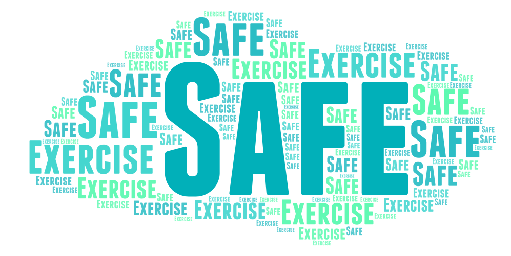

# 

# Safe Exercising 

A mobile application developed to supplement existing effort done by the government and volunteers in fighting against COVID-19.

## Getting Started

These instructions will get you a copy of the project up and running on your local machine for development and testing purposes. See deployment for notes on how to deploy the project on a live system.

### Prerequisites

- Mobile phone or simulator running iOS or Android
- [Expo](https://expo.io)
- [Npm](https://www.npmjs.com) or [Yarn](https://yarnpkg.com) 

### Test and Development

Travis CI was used to build and run automated tests. Publishing and building standalone apps tests were done. Try building with reference from https://docs.expo.io/distribution/building-standalone-apps/ . Got the env vars needed for Travis CI from [Turtle-CLI](https://github.com/expo/turtle-cli-example) page.

Most of the [backend](https://github.com/LeonardisOne/brainhack-blt2-backend) was done using AWS. 

## Build with

* [React Native](https://reactnative.dev)
* [AWS](https://aws.amazon.com/)

## Authors 

* [Barnabas](https://github.com/BarnabasLim)
* [Leonard](https://github.com/LeonardisOne)
* [Sheng Rong](https://github.com/TanShengRong)
* [Zhi Yang](https://github.com/tanzyy96)

## Acknowledgements

Our mentor, Lu Shiyun from DSTA, for answering our questions throughout the compeititon.